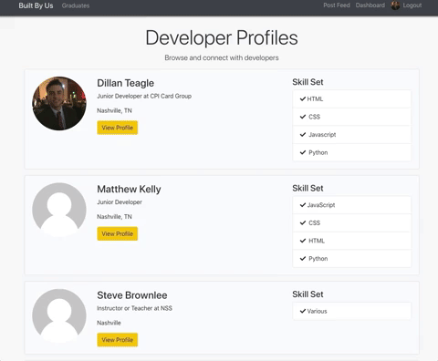
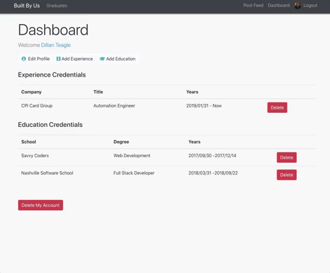
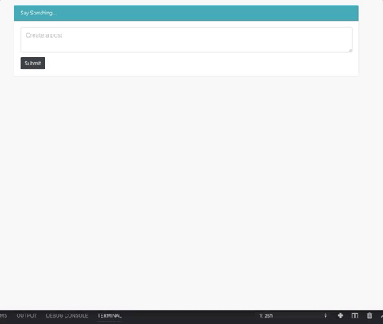
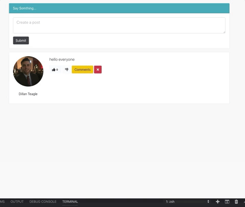

# Built By Us

A community for developers. I built this app straight out of Nashville Software School. The purpose is mind is to create a community that allows us to continue to learn and grow by sharing.

Each user has the benefits of contributing to the blog or creating their own post or lessons / tutorials. Every user can create a custom profile. This application can be used for hiring, training, self taught coders, and graduates like myself.

Built with the MERN stack.
(Mongoose, Express, React/Redux, Node.JS)

# FEATURES

## Developer User Profile
Every user can have their own profile to update accordingly.

## Customize your profile

Add your pinned github repo's, personal information, experience, education, and social accounts.

## Post feed
Communicate with others in the post feed, like or dislike eachother's posts.

## Comment threads
Reply to a post with threads or conversation structure.

# Dependencies

    bcryptjs: 2.4.3,
    body-parser: 1.18.3,
    express: 4.16.4,
    gravatar: 1.6.0,
    jsonwebtoken: 8.3.0,
    mongoose: 5.3.4,
    passport: 0.4.0,
    passport-jwt: 4.0.0,
    validator: 10.8.0

